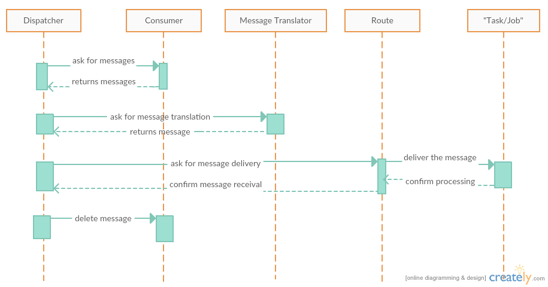

Overview
--------

Loafer is an asynchronous message dispatcher for concurrent tasks processing.

To take full advantage, your tasks:

1. Should use asyncio
2. Should be I/O bounded
3. Should be decoupled from the message producer

If your task are CPU bounded, you should look for projects that use
``multiprocessing`` python module or similar.

We don't require the use of asyncio, but any code that's not a coroutine
will run in thread, outside the event loop. Performance and error handling
might be compromised in this scenarios, you might want to look for other
alternatives.

If your code are too tied to the message producer, you might end writing too
much boilerplate code in order to use ``Loafer``.

Components
~~~~~~~~~~

The main components inside Loafer are:

* **Manager**

The manager is responsible to setup the event event loop and handle system errors.

It prepares everything needed to run and starts the dispatcher.

* **Dispatcher**

The dispatcher starts the providers, schedules the message routing and message acknowledgment.

* **Provider**

The provider is responsible for retrieving messages and delete it when requested.

The act is deleting a message is also known as message acknowledgment.

At the moment, we only have provider for AWS SQS service.

* **Message Translator**

The message translator is the contract between provider and handler.

At the moment, the message translator receives the "raw message" and
transform it to an appropriate format that is expected by the handler.

It may also add metadata information, if available.

* **Route**

The route is the link between the provider and handler. It is responsible
to deliver the message to handler and receive its confirmation.

* **Handler**

Handler or task/job, the callable that will receive the message.

**Error Handler**

The optional callback to handle any errors in message translation or in
the handler processing.

The message lifecycle
~~~~~~~~~~~~~~~~~~~~~

A simplified view of a message lifecycle is illustrated below:

