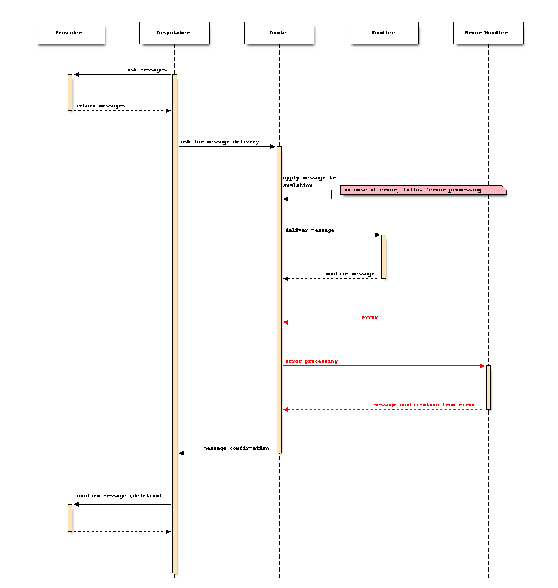

Overview
--------

Components
~~~~~~~~~~

The main components inside Loafer are:

* **Manager**

The manager is responsible to setup the event event loop and handle system errors.

It prepares everything needed to run and starts the dispatcher.

* **Dispatcher**

The dispatcher starts the consumers, schedules the message routing and message acknowledgment.

* **Consumer**

The consumer is responsible for retrieving messages and delete it when requested.

The act is deleting a message is also known as message acknowledgment.

At the moment, we only have consumer for AWS SQS service.

* **Message Translator**

The message translator is the contract between consumer and handler.

In the future it will also help the dispatcher choose a message destination
handler.

At the moment, the message translator receives the "raw message" and
transform it to an appropriate format that is expected by the handler.

* **Route**

The route is the link between the consumer and handler. It is responsible
to deliver the message to handler and receive its confirmation.

* **Handler**

Handler or task/job, the callable that will receive the message.

The message lifecycle
~~~~~~~~~~~~~~~~~~~~~

A simplified view of a message lifecycle is illustrated below:

